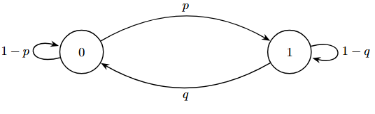

# Aula 5

**Data:** 18/03/2026

## Passeios Aleatórios em Grafos Localmente Finitos

$Def.:$ Um grafo $G=(V, E)$ consiste em:

$\qquad$  $V \neq \emptyset$, enumerável (Conjunto dos **vértices** de $G$).

$\qquad$  $E \subseteq \{\{u, v\} : u, v \in V, u \neq v\}$ (conjunto das **arestas** (elos) de $G$)

**Exemplo:**
$V=\{1, 2, 3\}$ e $E=\{\{1, 2\}, \{2, 3\}\} \subset \{\{1, 2\}, \{2, 3\}, \{1, 3\}\}$.

&emsp;Neste caso: $g(1)=1$, $g(2)=2$, $g(3)=1$.

---

Vizinhança e Grau

Dizemos que $u, v \in V$, com $u \neq v$, são **vizinhos** em $G$ se $\{u, v\} \in E$.

* **Notação:** $u \sim v$.

* O **grau** de um vértice $v \in V$ é definido por: $g(v) = |\{u,v : u \sim v\}|$.
> $\hookrightarrow$ # de vizinhos de $v$.

* Um grafo $G$ é **localmente finito** se $g(v) < \infty$ para todo $v \in V$.
> $\hookrightarrow$ Propriedade do vértice.

**Exemplos:**  
1.  $\mathbb{Z}$, como um grafo: $V=\mathbb{Z}$; $E = \{ \{u, u+1\} : u \in \mathbb{Z} \} = \bigcup_{u \in \mathbb{Z}} \{u, u+1\}$.  
&emsp;Aqui, $g(v)=2$ para todo $v \in \mathbb{Z}$.  
2.  $\mathbb{Z}^2$, como um grafo: $V=\mathbb{Z}^2$;  
$E = \bigcup_{(u, v) \in \mathbb{Z}^2} \{ \{(u, v), (u+1, v)\}, \{(u, v), (u-1, v)\}, \{(u, v), (u, v+1)\}, \{(u, v), (u, v-1)\} \}$
3.  Grafos finitos, i.e., quando V for finito, são localmente finitos.  
---

## Passeio Aleatório (P.A.)

Um **Passeio Aleatório** em um grafo $G=(V, E)$ localmente finito é uma Cadeia de Markov com espaço de estados $\mathcal{X}=V$ e matriz de transição $P(P(x,y))_{x,y \in \mathcal{X}}$ dada por:

$$P(x, y) = \begin{cases} \frac{1}{g(x)}, & \text{se } y \sim x \\ 0, & \text{se } y \not\sim x \end{cases}$$

Em cada passo, o P.A. muda sua posição atual para um de seus vizinhos, escolhido uniformemente.

### Distribuição Estacionária
**Proposição:** A medida estacionária $\pi$ de um P.A. em um grafo $G=(V, E)$ <u>finito</u> é dada por:

$$\pi(x) = \frac{g(x)}{\sum_{y \in V} g(y)} = \frac{g(x)}{2|E|}$$

**Prova:**

$$\sum_{y \in \mathcal{X}:y \sim x} \pi(y) P(y, x) = \sum_{y \in \mathcal{X}} \frac{g(y)}{2|E|} \cdot \frac{1}{g(y)} = \frac{1}{2|E|} \sum_{y \in \mathcal{X}:y \sim x} 1 = \frac{g(x)}{2|E|} = \pi(x)$$

Logo, $\pi = \pi P \implies \pi$ é <u>estacionária</u>.

---

### Caso Particular: O Anel (Regularidade)

**Caso particular:**

**(Anel)** $n=6$

$$\pi(x) =\frac{2}{2 \cdot n} = \frac{1}{n}$$

$$E = \{\{0,1\}, \{1,2\}, \dots, \{n-2, n-1\}, \{n-1, 0\}\}$$

$$\mathcal{X} = \{0, 1, \dots, n-1\}$$

$$
P(x,y) =  \begin{cases} 
\frac{1}{2} & , 	\text{se } y \in \{x-1, x+1\} 	\text{ se } 1 \le x \le n-2 \\ 
\frac{1}{2} & , 	\text{se } y \in \{1, n-1\} 	\text{ se } x=0 \\ 
\frac{1}{2} & , 	\text{se } y \in \{0, n-2\} 	\text{ se } x=n-1 \\ 
0 & , 	\text{c.c.} 
\end{cases}
$$

Esse P.A. **não** é um **processo estacionário** sob $\mathbb{P}_0$:

Se fosse estacionário,  

$$\mathbb{P}_0(X_0 = 0) = 1$$

$$\parallel$$

$$\mathbb{P}_0(X_1 = 0) = 0$$

O que seria um absurdo!

---

Se $g(v) = d$ para todo $v \in V$, o grafo $G=(V,E)$ é chamado de **d-regular**.

$\hookrightarrow$ O anel é um grafo **2-regular**.

**Note:** Se $G$ é d-regular, então

$$\pi(x) = \frac{g(x)}{\sum_{y \in \mathcal{X}} g(y)} = \frac{d}{d|V|} = \frac{1}{|V|}, \quad \forall x \in \mathcal{X}$$

$\hookrightarrow$ $\pi$ é a dist. uniforme em $V$.

---

## Irredutibilidade e Período

$(X_t)_{t \ge 0}$ C.M. com matriz $P = (P(x,y))_{x,y \in \mathcal{X}}$ é **irredutível** se, $\forall x, y \in \mathcal{X}, \exists t = t(x,y) \ge 0$ t.q.

$$\mathbb{P}_x(X_t = y) > 0$$

$\hookrightarrow$ $x$: de onde saio  
$\hookrightarrow$ $y$: alvo (onde quero ir)  
$\hookrightarrow$ $t = t(x,y) \ge 0$: um certo nº de passos  
$\hookrightarrow$ $> 0$:Tem uma chance de acontecer.

Como

$$\mathbb{P}_x (X_t = y) = \delta_x P^t_{(y)} = P^t(x, y),$$

A propriedade de ser **irredutível**, depende apenas da matriz $P$.

---

**Exemplo 1:** P.A. no anel é uma cadeia irredutível.
[Verificar]

**Exemplo 2:**

{ style="display: block; margin: 0 auto; width: 350px;" }

$$P = \begin{pmatrix} 1-p & p \\ q & 1-q \end{pmatrix}, \quad p, q \in [0, 1]$$

Se $0 < p, q < 1$, então a cadeia é **irredutível**.

Se $0 < p < 1$ e $q = 0$:

&emsp;Esta cadeia **não** é irredutível, pois $\mathbb{P}_1(X_t = 0) = 0, \forall t \ge 0$.

&emsp;$\hookrightarrow$ assim como o caso $p = q = 0$.

---

Dado um estado, com que frequência a cadeia volta nesse estado?

Para cada $x \in \mathcal{X}$,

$$\mathcal{T}(x) = \{t \ge 1 : P^t(x, x) > 0\}$$

$\hookrightarrow$ Conjunto dos instantes de tempo para os quais é possível a cadeia retornar ao ponto inicial.

**Ex:** P.A. anel ($n=6$): $\mathcal{T}(0) = \{2, 4, 6, \dots\} \quad \rightarrow$ o período do estado 0 é 2.

---

O **período** do estado $x \in \mathcal{X}$ é definido como máximo divisor comum $\mathcal{T}(x)$.

$\hookrightarrow$ Se a cadeia for irredutível todos os estados vão ter o mesmo período.

---

**Prop:** Todos os estados de uma C.M. irredutível têm o mesmo período.

O período de uma C.M. irredutível é definido como o período comum a todos os estados.

---

Dizemos que a cadeia é **Aperiódica**, se todos os estados têm período 1.

Se a cadeia é não Aperiódica, dizemos que ela é **Periódica**.
