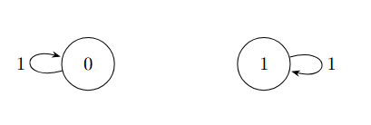
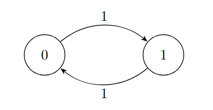

# Aula 7

**Data:** 23/03/2016

## 1. Revisão

Teorema(Existência e Unicidade de Distribuição Estacionária):  
C.M. com matriz de transição $P$. Para cada distribuição inicial $\nu$, defina, para $T \ge 1$:

$$\nu_T = \nu Q_T \quad onde \quad Q_T = \frac{1}{T} \sum_{t=0}^{T-1} P^t $$

O limite $\lim_{T \to \infty} \nu_T = \pi$ existe e $\pi$ é tal que $\pi = \pi P$

Vimos que,

$$\pi(y) = \lim_{T \to \infty} \mathbb{E}_{\nu} \left[ \frac{1}{T} \sum_{t=0}^{T-1} \mathbb{1}_{\{X_t = y\}} \right]$$

---

Exemplo de Dependência da Condição Inicial:  
Se a cadeia não for irredutível, o limite $\pi$ pode depender da distribuição inicial $\nu$:

{ style="display: block; margin: 0 auto; width: 300px;" }

* Se $\nu = (1, 0) \implies \pi = (1, 0)$
* Se $\nu = (0, 1) \implies \pi = (0, 1)$
* Se $\nu = (\frac{1}{2}, \frac{1}{2}) \implies \pi = (\frac{1}{2}, \frac{1}{2})$

---

## 2. Propriedades sob Irredutibilidade
Se, além disso, a cadeia é **irredutível**, então:  
&emsp;1. $\pi$ é única.  
&emsp;2. $\pi(x) > 0$ para todo $x \in \mathcal{X}$.

---

Exemplo:

{ style="display: block; margin: 0 auto; width: 300px;" }

$$\pi = \left( \frac{q}{p+q}, \frac{p}{p+q} \right), \quad p, q > 0$$

---

### Prova da segunda parte ($\pi(x) > 0)$

Fixe $x \in \mathcal{X}.$ Queremos mostrar que $\pi(x) > 0.$  
Como $\pi$ é uma medida de probabilidade, existe $y \in \mathcal{X}$ tal que $\pi(y) > 0$.  
Pela <u>irredutibilidade</u>, existe um tempo $t = t(y, x)$ tal que $P^t(y, x) > 0$.
Como $\pi = \pi P^t$ (pois $\pi$ é estacionaria):

$\qquad \Rightarrow \pi(x) = \sum_{z \in \mathcal{X}} \pi(z) P^t(z, x) \ge \pi(y) P^t(y, x) > 0$

### Prova da primeira parte (Unicidade)  
Suponha que existam $\pi_1$ e $\pi_2$ distribuições estacionárias para a cadeia($\pi_1 = \pi_1 P$ e $\pi_2 = \pi_2 P$)

Lembre que para cara $t \ge 1$ fixado, $\pi_1 = \pi_1 P^t$ e $\pi_2 = \pi_2 P^t$

Defina $y = \text{arg min}_{z \in \mathcal{X}} \frac{\pi_1(z)}{\pi_2(z)}$, i.e, 

y é tal que $\frac{\pi_1(y)}{\pi_2(y)} \le \frac{\pi_1(z)}{\pi_2(z)},\quad \forall z \in \mathcal{X}$

Logo,  

$\pi_1(y) = \sum_{x \in \mathcal{X}} \pi_1(x) P^t(x, y)  $

$= \sum_{x \in \mathcal{C}_y^t} \pi_1(x) P^t(x, y),\quad onde \mathcal{C}_y^t = {x \in \mathcal{X}: P^t(x,y) > 0}$

$= \sum_{x \in \mathcal{C}_y^t} \frac{\pi_1(x)}{\pi_2(x)} \pi_2(x) P^t(x, y)$

$\ge \frac{\pi_1(y)}{\pi_2(y)} \sum_{x \in \mathcal{C}_y^t} \pi_2(x) P^t(x, y)$

$ = \frac{\pi_1(y)}{\pi_2(y)} \sum_{x \in \mathcal{X}} \pi_2(y) = \pi_1(y)$

$ = \frac{\pi_1(y)}{\pi_2(y)} \pi_2(y) = \pi_1(y)$

$\Rightarrow \frac{\pi_1(x)}{\pi_2(x)} = \frac{\pi_1(y)}{\pi_2(y)}$ para todo $x \in \mathcal{C}_y^t$.

Como a cadeia é **irredutível**, dado $x$, existe $t = t(x,y)$ t.q. $P^t(x,y) > 0$:

$$\Rightarrow x \in \mathcal{C}_y^t \Rightarrow \frac{\pi_1(x)}{\pi_2(x)} = c \Rightarrow \pi_1(x) = c \cdot \pi_2(x)$$

$$\Rightarrow 1 = \sum_{x \in \mathcal{X}} \pi_1(x) = \sum_{x \in \mathcal{X}} c \cdot \pi_2(x)$$

$$= c \cdot \sum_{x \in \mathcal{X}} \pi_2(x) = c$$

$$\Rightarrow \pi_1 = \pi_2$$

---

## 3. Teorema de Convergência
Teorema (Teorema de Convergência)

Seja $(X_t)_{t \ge 0}$ uma C.M. com matriz $P$ **irredutível** e **aperiódica**.

Denote $\pi$ a única distribuição estacionária. Então, existem $\alpha \in (0, 1)$ e uma constante $C > 0$ tais que:

$$\max_{x \in \mathcal{X}} \frac{1}{2} \underbrace{\sum_{y \in \mathcal{X}} |P^t(x, y) - \pi(y)|}_{\| P^t(x, \cdot) - \pi \|_{TV}} \le C \cdot \alpha^t, \quad \forall t \ge 0$$

---

Aqui, para duas medidas de probabilidade $\mu$ e $\nu$ em $\mathcal{X}$:

$$\|\nu - \mu\|_{TV} = \frac{1}{2} \sum_{x \in \mathcal{X}} |\nu(x) - \mu(x)|$$

é chamada de **distância de Variação Total**.

---
### Contra-Exemplo: Cadeia Periódica

{ style="display: block; margin: 0 auto; width: 250px;" }

Considere uma cadeia com dois estados $\{0, 1\}$:

Periódica: Período 2

$$\pi = \left( \frac{1}{2}, \frac{1}{2} \right)$$ 

Analisando as probabilidades de transição a partir do estado 0 ($P^t(0, \cdot)$) e do estado 1 ($P^t(1, \cdot)$):

$$P^t(0,0) = \begin{cases} 0, & \text{se } t \text{ é ímpar} \\ 1, & \text{se } t \text{ é par} \end{cases}$$ 

Calculando a Distância de Variação Total ($TV$) em relação ao estacionário:

$$\| P^t(0, \cdot) - \pi \|_{TV} = \frac{1}{2} \left[ |P^t(0, 0) - \pi(0)| + |P^t(0, 1) - \pi(1)| \right]$$ 

$$= \begin{cases} \frac{1}{2}, & \text{se } t \text{ é ímpar} \\ \frac{1}{2}, & \text{se } t \text{ é par} \end{cases}$$ 

$$\Rightarrow \forall t \ge 1, \quad \| P^t(0, \cdot) - \pi \|_{TV} = \frac{1}{2}$$

---

## 4. Distância ao Estacionário e Tempo de Mistura
Defina para $t \ge 0$:  

* $d(t) = \max_{x \in \mathcal{X}} \| P^t(x, \cdot) - \pi \|_{TV}$  
* $\bar{d}(t) = \max_{x, y \in \mathcal{X}} \| P^t(x, \cdot) - P^t(y, \cdot) \|_{TV}$

**Propriedades:**  
&emsp;1. $d(t) \le \bar{d}(t) \le 2 d(t)$  
&emsp;2. $d(t)$ é não-crescente.  
&emsp;3. $\bar{d}$ é submultiplicativa, i.e., $\bar{d}(s+t) \le \bar{d}(s) \cdot \bar{d}(t)$.[Verificar]  

### Tempo de Mistura ($t_{mix}$)
O **tempo de mistura** de uma Cadeia de Markov é dado por:

$$t_{mix}(\epsilon) = \min \{ t \ge 0 : d(t) \le \epsilon \}, \quad \epsilon > 0$$

Pelo item 2 da prop., $d(t) \le \epsilon, \forall t \ge t_{mix}(\epsilon)$.

O tempo de mistura de referência é:

$$t_{min} := t_{mix}\left(\frac{1}{4}\right)$$

---

**Proposição:** Para todo $\epsilon < 1$,

$$t_{mix}(\epsilon) \le t_{mix} \lceil \log_2 \epsilon^{-1} \rceil$$
