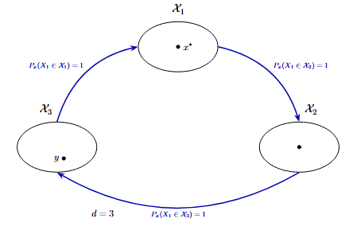
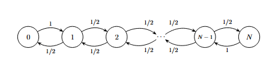

# Aula 8

**Data:** 25/03/2026

## 1. Revisão e o Problema da Periodicidade
No **Teorema de Convergência** para uma Cadeia de Markov **irredutível** e **aperiódica**, estabelecemos que a distância ao estacionário $d(t)$ decai exponencialmente:

$$d(t) = \max_{x \in \mathcal{X}} \|P^t(x, \cdot) - \pi\|_{TV} \le C \cdot \alpha^t$$

onde $C > 0$ e $\alpha \in (0, 1)$.

---

**Pergunta:** O que acontece quando a cadeia é **periódica**? 

Considere a **versão preguiçosa** da cadeia: C.M. com matriz de transição $Q$ dada por:

$$Q(x,y) = \frac{1}{2}(I(x,y) + P(x,y)) , \quad \forall x,y \in \mathcal{X}$$

&emsp;&emsp;onde $I = (I(x,y))_{x,y \in \mathcal{X}}$ é a **matriz identidade**

Essa modificação torna a cadeia **aperiódica e irredutível**, permitindo a convergência padrão.[Verificar]

---

## 2. Decomposição Cíclica
**Proposição:** Seja $(X_t)_{t \ge 0}$ uma C.M. **irredutível** com período $d$, então $d$ é o maior inteiro para o qual existe uma partição de $\mathcal{X}$ em subconjuntos $\mathcal{X}_1, \dots, \mathcal{X}_d$ tais que: 

$$\mathbb{P}_x(X_1 \in \mathcal{X}_{r+1}) = 1, \quad \forall x \in \mathcal{X}_r, \forall 1 \le r \le d-1$$ 

e

$$\mathbb{P}_x(X_1 \in \mathcal{X}_1) = 1, \quad \forall x \in \mathcal{X}_d$$ 

Além disso, $(X_{td})_{t \ge 0}$ é uma C.M. **irredutível** e **aperiódica**, restrita a $\mathcal{X}_r$. 

{ style="display: block; margin: 0 auto; width: 450px;" }

**Prova:** Fixe $x_* \in \mathcal{X}$ e considere para cada $y \in \mathcal{X}$,

$$\mathcal{T}(x_*, y) = \{t \ge 0 : P^t(x_*, y) > 0\}$$

Note que:

$$\mathcal{T}(x_*, x_*) = \{t \ge 0 : P^t(x_*, x_*) > 0\} \subset \{td : t \ge 0\}$$

Se $m, k \in \mathcal{T}(x_*, y)$ e $P^t(y, x_*) > 0$, então $k$ e $m$ têm o mesmo resto na divisão por $d$. Isso implica que a cadeia só pode visitar $y$, saindo de $x_*$, em instantes de tempo $r, d+r, 2d+r, \dots$, onde $0 \le r \le d-1$.

---

Consequentemente, podemos definir:

$$\mathcal{X}_r = \{y \in \mathcal{X} : \mathcal{T}(x_*, y) \subset \{td + r - 1 : t > 0\}\}, \quad 1 \le r \le d$$

Claramente, $\mathcal{X}_1, \mathcal{X}_2, \dots, \mathcal{X}_r$ formam uma partição e $\mathbb{P}_x(X_1 \in \mathcal{X}_{n+1}) = 1, \forall x \in \mathcal{X}_r$.

Observe que como $t+m$ e $t+k \in \mathcal{T}(x_*, x_*)$, então:

$$\begin{aligned}
t + m &= m_1 d \\
t + k &= m_2 d
\end{aligned}$$

Escreva $t = m_0 d + r$, com $0 \le r < d$. Como $k > 0$, então:

$$\begin{aligned}
m_2 d = t + k &> t = m_0 d + r \\
&\ge m_0 d
\end{aligned}$$

$$\Rightarrow (m_2 - m_0) d > 0 \Rightarrow m_2 - m_0 > 0 \Rightarrow m_2 \ge m_0 + 1$$

De forma análoga, $m_1 \ge m_0 + 1$. Usando isso podemos concluir a afirmação. Note que:

$$\begin{aligned}
m &= m_1 d - t = m_1 d - m_0 d - r \\
k &= m_2 d - t = m_2 d - m_0 d - r
\end{aligned}$$

Se $r = 0$, então $m = (m_1 - m_0) d$ e $k = (m_2 - m_0) d \Rightarrow k$ e $m$ têm resto 0 na divisão por $d$.

Se $1 < r < d - 1$, então:

$$\begin{aligned}
m &= (m_1 - (m_0 + 1)) d + d - r \\
k &= (m_2 - (m_0 + 1)) d + d - r
\end{aligned}$$

$\Rightarrow m$ e $k$ têm resto $d - r$.

---

## 3. Exemplo: Passeio Aleatório (Simétrico)
Cadeia de Markov com $\mathcal{X} = \{0, 1, \dots, N\}$ com **fronteira refletora**.

{ style="display: block; margin: 0 auto; width: 400px;" }

Esta cadeia é **Irredutível** e **periódica** com $d = 2$. Podemos escolher a partição:

$$\begin{aligned}
\mathcal{X}_1 &= \{x \in \mathcal{X} : x \text{ é par}\} \\
\mathcal{X}_2 &= \{x \in \mathcal{X} : x \text{ é ímpar}\}
\end{aligned}$$
---

## 4. Convergência de Médias
**Corolário:** Seja $(X_t)_{t \ge 0}$ uma C.M. **Irredutível**, com período $d > 1$, matriz de transição $P$ e única distribuição estacionária $\pi$. Sejam $\mathcal{X}_1, \dots, \mathcal{X}_d$ a partição dos estados como na proposição anterior. Então:

$$\forall x \in \mathcal{X}_r, \quad \pi(x) = \frac{\pi_r(x)}{d}$$

onde $\pi_r$ é a única distribuição estacionária da cadeia $(X_{td})_{t \ge 0}$ restrita a $\mathcal{X}_r$. 

Além disso,

$$\lim_{t \to \infty} \frac{P^t(x_*, y) + P^{t+1}(x_*, y) + \dots + P^{t+d-1}(x_*, y)}{d} = \pi(y), \quad \forall y \in \mathcal{X}$$

>$\hookrightarrow$ Para cada instante de tempo $t$, apenas uma das parcelas no numerador é positiva.